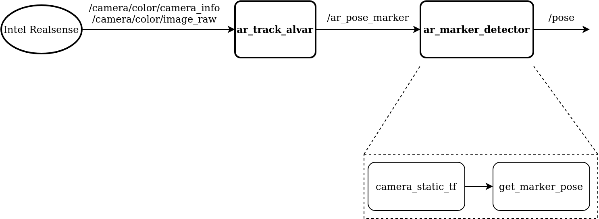

# ar_marker_detector
ROS package to get the AR marker pose using the camera
### camera_static_tf
To get the transform of the camera frame with respect to the robot frame
- broadcast of type `StaticTransformBroadcaster()`
- Broadcasts `geometry_msgs.msg.TransformStamped()`   

### getmarker_pose 
To calculate the pose of the marker using the camera
- Subscribe to topic `ar_pose_marker` of type `AlvarMarkers`
- Service `/getMarkerPose` of type `getMarkerPose`
-  Publishes `Pose of the marker ` of type `Pose`

### Architecture

### Usage
`roslaunch ar_marker_detector marker_detector.launch`
`roservice call /getMarkerPose`
