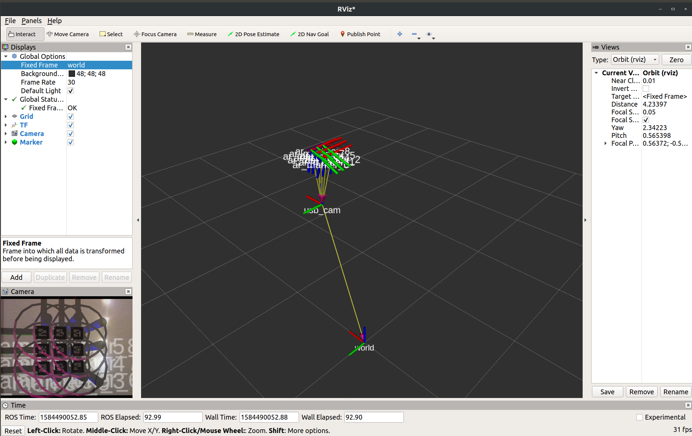

# ar_marker_detector
ROS package to get the AR marker pose using the camera
### camera_static_tf
To get the transform of the camera frame with respect to the robot frame
- broadcast of type `StaticTransformBroadcaster()`
- Broadcasts `geometry_msgs.msg.TransformStamped()`   

### get_marker_pose 
To calculate the pose of the marker using the camera
- Subscribe to topic `ar_pose_marker` of type `AlvarMarkers`
- Service `/getMarkerPose` of type `getMarkerPose`
-  Publishes `Pose of the marker ` of type `Pose`
### get_twomarker_pose 
To calculate the pose of the marker using the camera
- Subscribe to topic `ar_pose_marker` of type `AlvarMarkers`
- Service `/getPickPose` of type `getMarkerPose`
- Service `/getPlacePose` of type `getMarkerPose`
- Publishes `Pose of the marker ` of type `Pose`
### Architecture

### Usage
- `roslaunch ar_marker_detector marker_detector.launch`
For getting the pose of one Marker(Pick location only)
- `roservice call /getMarkerPose`
For getting the pose of two Marker(Pick and Place location)
- `rosservice call /getPickPose "ar_marker_id: 0"`
- `rosservice call /getPlacePose "ar_marker_id: 2"`
Note: ar_marker_id = [0,8]  for our task

### Results

